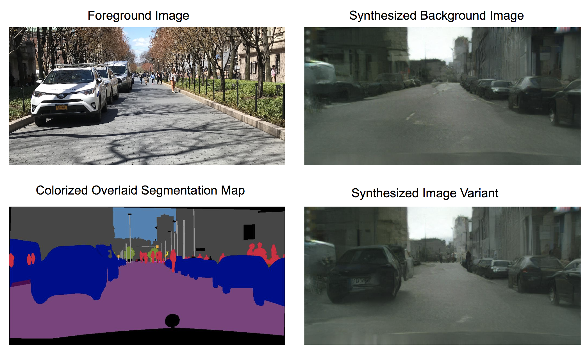
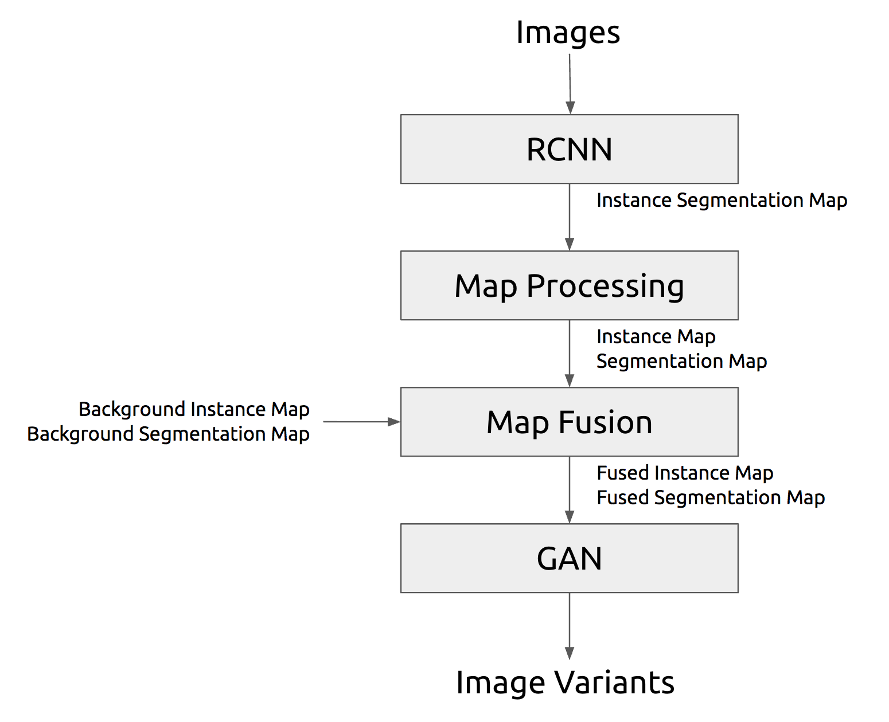

# Image Variant Generation

#### A pipeline for image variant generation using [pix2pixHD](https://tcwang0509.github.io/pix2pixHD/) and [Mask RCNN](https://github.com/matterport/Mask_RCNN).





#### Architecture



#### Usage
```bash
./master.sh <background_semantic_map> <background_instance_map>
```
